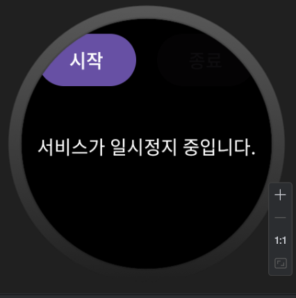
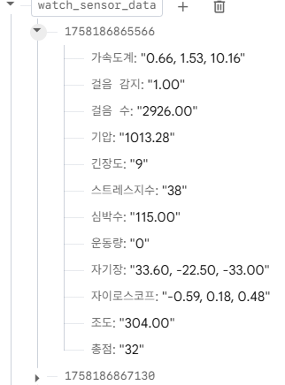

# Portfolio_WearOS
## 주요 기능

- 심박수, 걸음 수, 걸음 감지, 가속도계, 자이로스코프, 조도 등 다양한 센서 데이터 수집
- 센서 값을 바탕으로 **스트레스 지수, 긴장도, 운동량, 총점** 계산
- Foreground Service + WakeLock을 이용한 **백그라운드 연속 동작**
- Firebase Realtime Database 연동 (포트폴리오용으로 민감 정보는 제거)

## 보안 관련 안내

이 레포지토리는 포트폴리오용으로, **실제 서비스에 사용되는 민감 정보는 의도적으로 포함하지 않았습니다.**

- `google-services.json` 파일은 **보안을 위해 GitHub에 업로드하지 않았습니다.**
- Firebase Realtime Database URL 및 기타 비공개 키 값은  
  코드에서 직접 노출하지 않고, 로컬 환경 설정 또는 별도 설정 파일을 통해 주입하도록 설계하는 것을 전제로 합니다.
- 따라서, 이 레포만 클론해서는 바로 Firebase 연동이 되지 않으며,  
  **본인의 Firebase 프로젝트로 교체한 후** 실행해야 합니다.

## 실행 화면

워치에서 센서 수집 및 Firebase 업로드가 동작하는 예시 화면입니다.

